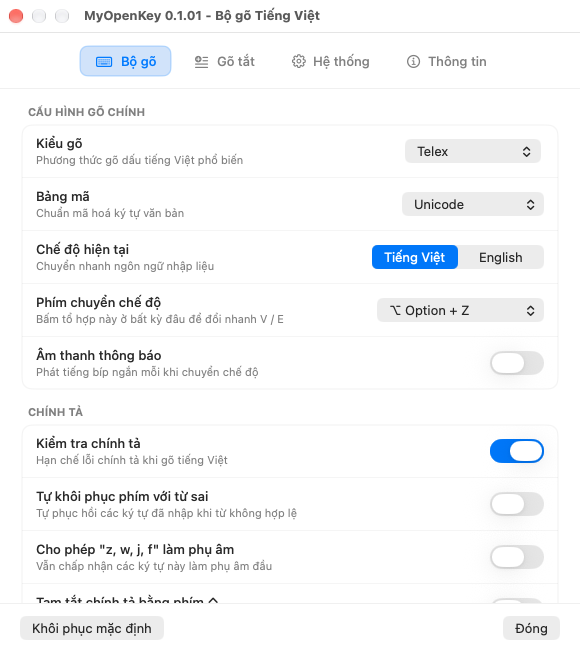
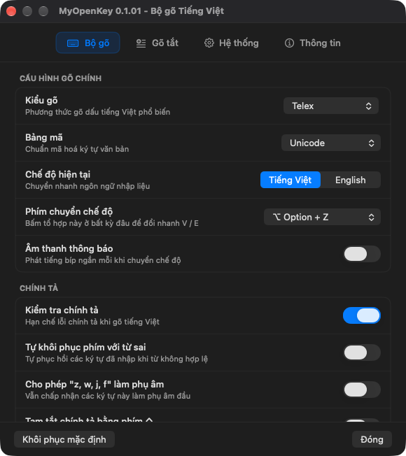
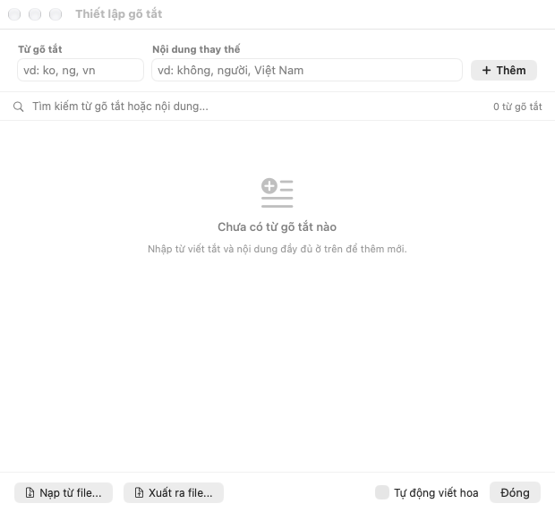
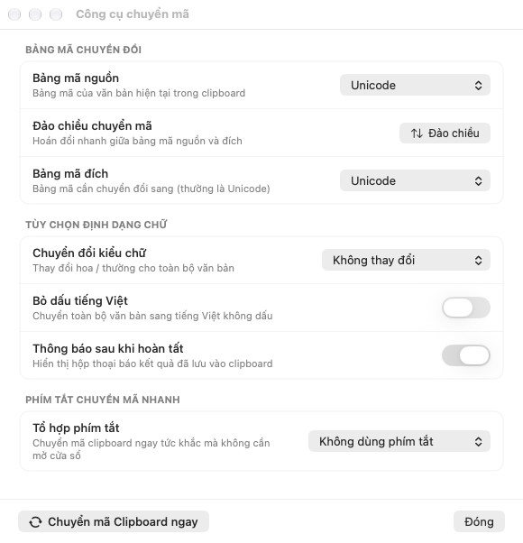
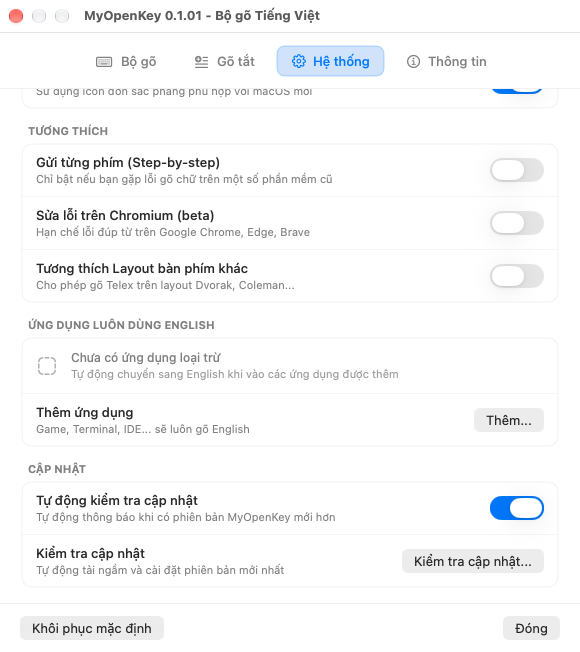

# MyOpenKey

<p align="center">
  
</p>

<p align="center">
  <strong>Bộ gõ tiếng Việt hiện đại, thanh lịch và mượt mà dành riêng cho macOS.</strong>
</p>

<p align="center">
  <a href="https://github.com/hqdvn/MyOpenKey/releases/latest"></a>
  
  
  <a href="LICENSE"></a>
  <a href="https://hqd.vn"></a>
</p>

---

## ✨ Điểm nổi bật của MyOpenKey

**MyOpenKey** là phiên bản cải tiến toàn diện được tái thiết kế dành riêng cho người dùng Mac thế hệ mới (macOS 12 Monterey, macOS 13 Ventura, macOS 14 Sonoma, macOS 15 Sequoia và mới hơn):

### 🎨 1. Giao diện Bảng điều khiển chuẩn hiện đại
- Được xây dựng hoàn toàn bằng **SwiftUI** theo phong cách **Inset-Grouped Cards** tinh tế.
- Từng tính năng đều có tiêu đề rõ ràng kèm phụ đề giải thích chi tiết, không còn giấu trong tooltip.
- Biểu tượng Menu bar thế hệ mới: hỗ trợ cả **màu gradient xanh cyan nổi bật** lẫn **chế độ đơn sắc hiện đại (`Template`)** tự động thích ứng hoàn hảo với Dark Mode và Light Mode của macOS.
- Hỗ trợ đầy đủ **VoiceOver** và khả năng điều hướng bàn phím chuẩn hệ sinh thái Apple.

### ⚡ 2. Ổn định tối đa & Chống đơ phím
- **Tự động kết nối lại (`EventTap Watchdog`)**: Bộ hẹn giờ mỗi 500ms tự động phát hiện và bật lại kết nối bàn phím nếu macOS ngắt EventTap sau khi máy Sleep/Wake hoặc mở khóa màn hình.
- **Cải thiện độ ổn định Backspace**: Cấp phát sự kiện Backspace mới cho mỗi thao tác gửi (`PostBackspaceEvent`), khắc phục lỗi nghẽn hàng đợi phím trên Apple Mail và các ứng dụng WebKit.
- **Giảm tải sự kiện thừa**: Bỏ hook sự kiện kéo chuột (`MouseDragged`) khỏi bộ lắng nghe để tiết kiệm tài nguyên xử lý.
- **Xử lý đa màn hình & Spaces**: Bảng điều khiển tự động di chuyển đến Desktop/Space đang hoạt động khi mở từ Menu bar.

### 🌐 3. Hỗ trợ phím chuyển nhanh 🌐 Fn (Globe)
- Hỗ trợ chuyển đổi nhanh Tiếng Việt $\leftrightarrow$ English chỉ với **1 lần nhấn phím 🌐 Fn** trên các bàn phím Mac đời mới (tương tự như trải nghiệm của bộ gõ Apple mặc định).
- Đi kèm các tổ hợp phím tắt tiêu chuẩn: `⌥ Option + Z`, `⌃ Control + ⇧ Shift`, `⌘ Command + ⇧ Shift`, `⌃ Control + Space`,...

### 🛡️ 4. Danh sách loại trừ ứng dụng (App Exclusion)
- Cho phép bạn tự thêm các ứng dụng (Terminal, iTerm2, VS Code, Game...) vào danh sách loại trừ trong tab Hệ thống.
- Khi chuyển sang ứng dụng trong danh sách, MyOpenKey tự động đổi sang **English (E)**; khi chuyển về ứng dụng bình thường, app sẽ tự khôi phục lại **Tiếng Việt (V)**.

### 🔄 5. Khởi động cùng hệ thống (`SMAppService`)
- Hỗ trợ đăng ký khởi động cùng hệ thống thông qua kiến trúc native `SMAppService` trên macOS 13 (Ventura) trở lên, xuất hiện minh bạch trong *System Settings ➔ General ➔ Login Items*. (Lưu ý: trên macOS 12 Monterey, tính năng khởi động cùng máy chưa khả dụng do hệ thống yêu cầu `SMAppService` native).

### 🔀 6. Công cụ chuyển mã & Gõ tắt hiện đại
- **Công cụ chuyển mã (Convert Tool)**: Xây dựng hoàn toàn bằng SwiftUI với Inset-Grouped cards, hỗ trợ đảo chiều bảng mã 1-click, tùy chọn đổi hoa/thường, bỏ dấu tiếng Việt, gán phím tắt chuyển mã clipboard tức thì.
- **Thiết lập gõ tắt (Macro Manager)**: Tìm kiếm thời gian thực, thêm/sửa từ gõ tắt nhanh, nạp và xuất file định nghĩa linh hoạt.

### 🚀 7. Tự động cập nhật 1-click (Sparkle 2)
- Tích hợp framework Sparkle 2 (Ed25519) an toàn, tự động kiểm tra bản mới khi khởi động và hỗ trợ cập nhật 1-click trực tiếp ngay trong ứng dụng với giao diện tiếng Việt bản địa hóa hoàn chỉnh.
---

## 📸 Giao diện ứng dụng

<p align="center">
  
  
</p>

<p align="center">
  
  
</p>

<p align="center">
  
</p>
---

## ⌨️ Kiểu gõ & Bảng mã hỗ trợ

- **Kiểu gõ:** Telex, VNI, Simple Telex 1, Simple Telex 2.
- **Bảng mã:** Unicode dựng sẵn, TCVN3 (ABC), VNI Windows, Unicode tổ hợp, Vietnamese Locale CP 1258.
- **Tính năng mở rộng:**
  - Đặt dấu kiểu mới (`oà`, `uý` thay vì `òa`, `úy`).
  - Gõ nhanh phụ âm ghép (`cc` $\rightarrow$ `ch`, `gg` $\rightarrow$ `gi`, `kk` $\rightarrow$ `kh`, `nn` $\rightarrow$ `ng`, `qq` $\rightarrow$ `qu`, `pp` $\rightarrow$ `ph`, `tt` $\rightarrow$ `th`).
  - Gõ tắt phụ âm đầu (`f` $\rightarrow$ `ph`, `j` $\rightarrow$ `gi`, `w` $\rightarrow$ `qu`) và phụ âm cuối (`g` $\rightarrow$ `ng`, `h` $\rightarrow$ `nh`, `k` $\rightarrow$ `ch`).
  - Bảng gõ tắt không giới hạn độ dài ký tự, hỗ trợ tự động viết hoa thông minh theo phím tắt (`ko` $\rightarrow$ `không`, `Ko` $\rightarrow$ `Không`, `KO` $\rightarrow$ `KHÔNG`).
  - Sửa lỗi gợi ý tự động (autocomplete) trên thanh địa chỉ trình duyệt Chrome, Edge, Safari và Microsoft Excel.

---

## 📥 Cài đặt

1. Tải về file `.dmg` hoặc `.zip` của phiên bản mới nhất tại [MyOpenKey Releases](https://github.com/hqdvn/MyOpenKey/releases/latest).
2. Mở file `.dmg` ➔ Kéo thả biểu tượng **MyOpenKey** vào thư mục **Applications**.
3. **Mở ứng dụng lần đầu (Bỏ qua cảnh báo Gatekeeper của macOS)**:
   - Do ứng dụng nguồn mở chưa đăng ký chứng chỉ trả phí $99/năm của Apple, macOS Sequoia / Sonoma sẽ hiện cảnh báo *"Apple could not verify..."*.
   - **Cách mở**: Vào **Cài đặt hệ thống (System Settings)** ➔ **Quyền riêng tư & Bảo mật (Privacy & Security)** ➔ Kéo xuống mục *Bảo mật (Security)* thấy dòng `"MyOpenKey" đã bị chặn...` ➔ Bấm **Vẫn mở (Open Anyway)** ➔ Nhập mật khẩu máy và chọn **Mở (Open)**.
   - *(Hoặc mở nhanh qua Terminal: `xattr -cr /Applications/MyOpenKey.app`)*.
4. **Cấp quyền Trợ năng (Accessibility)**:
   - Khi mở lên, app sẽ yêu cầu cấp quyền để điều khiển phím.
   - Chọn **Cấp quyền** ➔ Bật công tắc cho phép **MyOpenKey** trong mục *Trợ năng (Accessibility)*.
5. Mở lại **MyOpenKey** và tận hưởng trải nghiệm gõ tiếng Việt mượt mà!
> **Lưu ý:** Để tránh xung đột phím, bạn nên tắt hoặc xóa các bộ gõ tiếng Việt khác đang chạy trên máy trước khi sử dụng.

---

## 🛠️ Biên dịch từ mã nguồn

MyOpenKey hỗ trợ biên dịch trực tiếp bằng Xcode 14 trở lên trên cả chip Apple Silicon (M1/M2/M3/M4) lẫn Intel:

```bash
# Clone kho mã nguồn
git clone https://github.com/hqdvn/MyOpenKey.git
cd MyOpenKey

# Biên dịch bản Release Universal Binary
xcodebuild -project Sources/OpenKey/macOS/OpenKey.xcodeproj \
  -scheme OpenKey -configuration Release -derivedDataPath build \
  CODE_SIGN_IDENTITY=- CODE_SIGN_STYLE=Manual DEVELOPMENT_TEAM= build

# Cài đặt vào thư mục Applications
cp -R build/Build/Products/Release/MyOpenKey.app /Applications/
```

Xem thêm hướng dẫn chi tiết tại [macOS_Build.md](macOS_Build.md).

---

## 👨‍💻 Tác giả & Liên hệ

- **Nhà phát triển:** **Huỳnh Quốc Đạt**
- **Website:** [hqd.vn](https://hqd.vn)
- **Email:** [work@hqd.vn](mailto:work@hqd.vn)
- **Mã nguồn dự án:** [github.com/hqdvn/MyOpenKey](https://github.com/hqdvn/MyOpenKey)

---

## 📜 Ghi nhận & Bản quyền

- MyOpenKey được phát triển và tối ưu hóa dựa trên nền tảng bộ máy gõ mã nguồn mở [OpenKey](https://github.com/tuyenvm/OpenKey) của tác giả **Mai Vũ Tuyên** (© 2019).
- Toàn bộ dự án được phát hành công khai và minh bạch theo giấy phép **[GNU General Public License v3.0 (GPLv3)](LICENSE)**.
