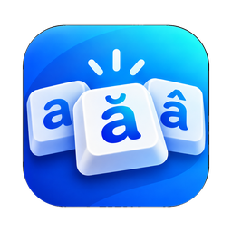
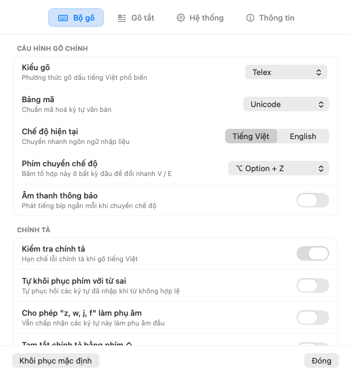
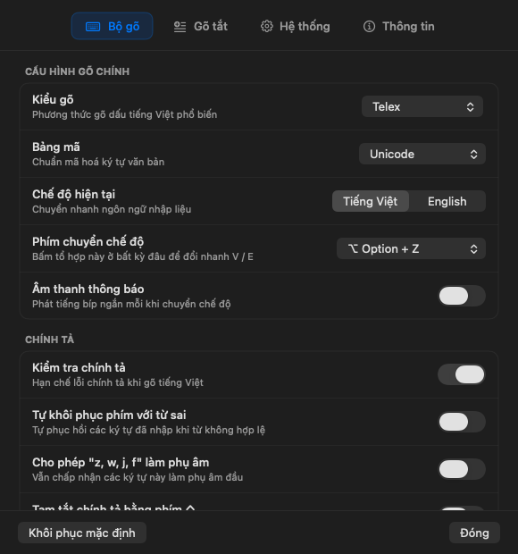
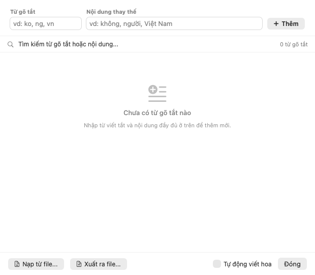
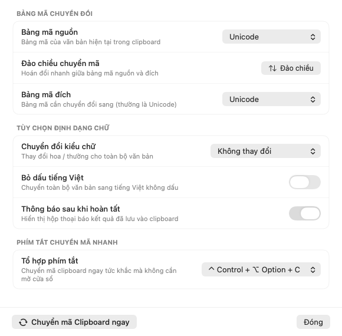
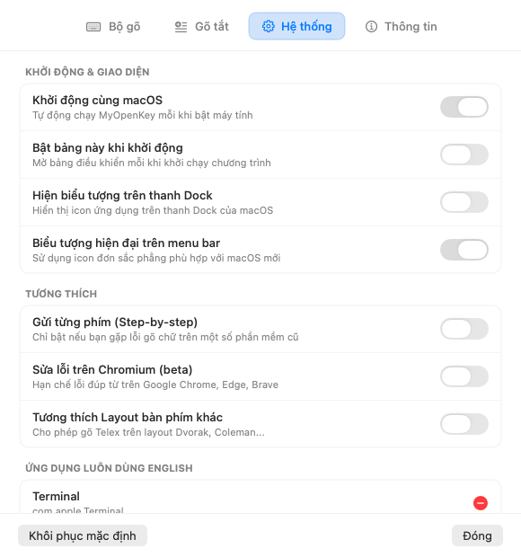

# MyOpenKey

<p align="center">
  
</p>

<p align="center">
  <strong>Bộ gõ tiếng Việt nhanh, ổn định và dễ dùng cho macOS.</strong>
</p>

<p align="center">
  <a href="https://github.com/hqdvn/MyOpenKey/releases/latest"></a>
  
  
  <a href="LICENSE"></a>
  <a href="https://hqd.vn"></a>
</p>

---

MyOpenKey là bộ gõ tiếng Việt mã nguồn mở cho macOS (yêu cầu macOS 13 Ventura trở lên). Ứng dụng tập trung vào sự ổn định khi nhập liệu hàng ngày, khắc phục lỗi nhảy chữ, mất chữ và xung đột với các ứng dụng hệ thống.

## ✨ Điểm nổi bật

* **Gõ ổn định, không kẹt phím:** Khắc phục lỗi mất chữ khi gõ nhanh trong Spotlight, Alfred, thanh địa chỉ trình duyệt và Microsoft Excel. Tự kết nối lại bộ gõ ngay sau khi máy thức dậy từ chế độ Sleep.
* **Chuyển chế độ bằng phím Fn (Globe):** Đổi nhanh giữa Tiếng Việt và Tiếng Anh chỉ với 1 lần nhấn phím `Fn` trên bàn phím Mac, hoặc dùng các tổ hợp quen thuộc (`⌥ Option + Z`, `⌃ Control + Space`, `⌘ Command + ⇧ Shift`).
* **Tự động chuyển chế độ theo ứng dụng (App Exclusion):** Tự chuyển sang tiếng Anh khi mở Terminal, VS Code hay game; tự quay lại tiếng Việt khi về trình duyệt hoặc ứng dụng văn phòng.
* **Giao diện trực quan:** Bảng điều khiển rõ ràng, dễ thiết lập, hỗ trợ đầy đủ Dark Mode và biểu tượng thích ứng trên thanh Menu bar.
* **Công cụ chuyển mã & Gõ tắt:** Quản lý phím tắt gõ tắt không giới hạn độ dài. Chuyển đổi nhanh giữa các bảng mã (Unicode, TCVN3, VNI) trực tiếp từ clipboard.
* **Khởi động cùng hệ thống:** Quản lý tự khởi động khi đăng nhập thông qua cơ chế chuẩn của macOS trong phần Cài đặt hệ thống.
* **Tự động cập nhật:** Tích hợp kiểm tra và cập nhật bản mới an toàn, nhanh chóng ngay trong ứng dụng.

---

## 📸 Giao diện ứng dụng

<p align="center">
  
  
</p>

<p align="center">
  
  
</p>

<p align="center">
  
</p>

---

## ⌨️ Kiểu gõ & Bảng mã hỗ trợ

- **Kiểu gõ:** Telex, VNI, Simple Telex 1, Simple Telex 2.
- **Bảng mã:** Unicode dựng sẵn, Unicode tổ hợp, TCVN3 (ABC), VNI Windows, Vietnamese Locale CP 1258.
- **Tính năng mở rộng:**
  - Đặt dấu kiểu mới (`oà`, `uý` thay vì `òa`, `úy`).
  - Gõ nhanh phụ âm ghép (`cc` → `ch`, `gg` → `gi`, `kk` → `kh`, `nn` → `ng`, `qq` → `qu`, `pp` → `ph`, `tt` → `th`).
  - Gõ tắt phụ âm đầu (`f` → `ph`, `j` → `gi`, `w` → `qu`) và phụ âm cuối (`g` → `ng`, `h` → `nh`, `k` → `ch`).
  - Tự động viết hoa thông minh theo từ viết tắt (`ko` → `không`, `Ko` → `Không`, `KO` → `KHÔNG`).
  - Sửa lỗi gợi ý tự động (autocomplete) trên thanh địa chỉ trình duyệt Chrome, Edge, Safari và Microsoft Excel.

---

## 📥 Cài đặt

1. Tải bản phát hành mới nhất tại [MyOpenKey Releases](https://github.com/hqdvn/MyOpenKey/releases/latest) (chọn file `.dmg`).
2. Mở file `.dmg` và kéo biểu tượng **MyOpenKey** vào thư mục **Applications**.
3. Mở ứng dụng và bật quyền **Trợ năng (Accessibility)** trong *Cài đặt hệ thống* theo hướng dẫn để sử dụng.

---

## 🛠️ Biên dịch từ mã nguồn

Yêu cầu Xcode 14 trở lên trên macOS 13+. Hỗ trợ cả chip Apple Silicon lẫn Intel:

```bash
# Clone mã nguồn
git clone https://github.com/hqdvn/MyOpenKey.git
cd MyOpenKey

# Biên dịch bản Release Universal Binary
xcodebuild -project Sources/OpenKey/macOS/OpenKey.xcodeproj \
  -scheme OpenKey -configuration Release -derivedDataPath build \
  CODE_SIGN_IDENTITY=- CODE_SIGN_STYLE=Manual DEVELOPMENT_TEAM= build

# Cài đặt vào Applications
cp -R build/Build/Products/Release/MyOpenKey.app /Applications/
```

Chi tiết xem tại [macOS_Build.md](macOS_Build.md).

---

## 👨‍💻 Tác giả & Liên hệ

- **Nhà phát triển:** **Huỳnh Quốc Đạt**
- **Website:** [hqd.vn](https://hqd.vn)
- **Email:** [work@hqd.vn](mailto:work@hqd.vn)
- **Mã nguồn dự án:** [github.com/hqdvn/MyOpenKey](https://github.com/hqdvn/MyOpenKey)

---

## 📜 Ghi nhận & Bản quyền

- MyOpenKey được phát triển và tối ưu hóa dựa trên nền tảng bộ gõ mã nguồn mở [OpenKey](https://github.com/tuyenvm/OpenKey) của tác giả **Mai Vũ Tuyên** (© 2019).
- Phát hành công khai theo giấy phép **[GNU General Public License v3.0 (GPLv3)](LICENSE)**.
